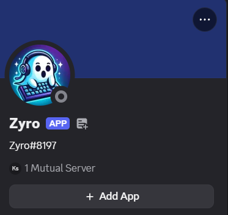
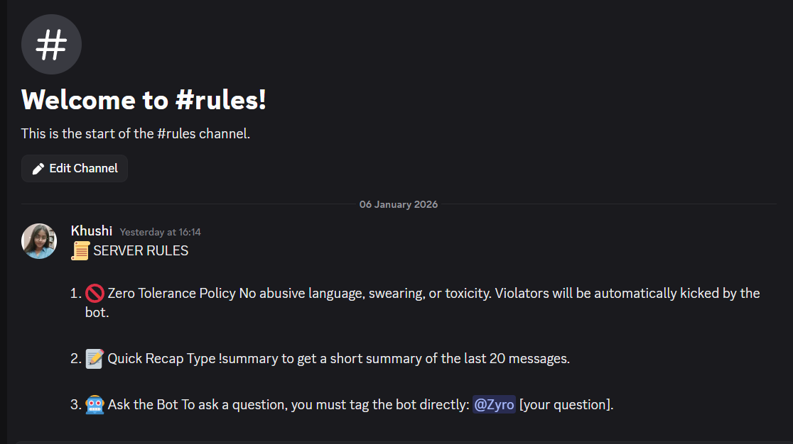

# 🤖 Zyro Discord Bot



Zyro is an AI-powered Discord bot built using **Node.js**, **discord.js**, and **Groq LLM APIs**.  
It enhances Discord servers by providing **AI chat replies**, **chat summaries**, **welcome messages**, and **automatic moderation** for abusive language.

---

## 🚀 Features



- 🤖 **AI Chat Assistant**
  - Mention the bot to get intelligent AI-powered replies using Groq LLM.

- 📝 **Chat Summary**
  - Generate a short, funny Hinglish-style summary of the last 20 messages.
  - Commands:
    - `!summary`
    - `!saransh`

- 👋 **Welcome System**
  - Automatically welcomes new members in `#general` channel.

- 🚫 **Abusive Language Moderation**
  - Detects abusive words.
  - Automatically **kicks non-admin users** using abusive language.
  - Admins receive only a warning.

- ⚡ **Fast AI Responses**
  - Powered by **Groq SDK** for low-latency AI responses.

---

## 🛠 Tech Stack

- **Node.js**
- **discord.js**
- **Groq SDK**
- **dotenv**
- **JavaScript**

---

## 📁 Project Structure
```
Zyro_Discord_Bot/
│
├── src/
│ └── services/
│ └── ai.service.js
│
├── .env
├── index.js
├── package.json
└── README.md
```
## 🧠 AI Models Used

- LLaMA 3.1 (8B Instant) – AI chat replies


## 👨‍💻 Author

Khushi Sharma - 
**MERN Stack Developer**

GitHub: [Khushu2005](https://github.com/Khushu2005)
